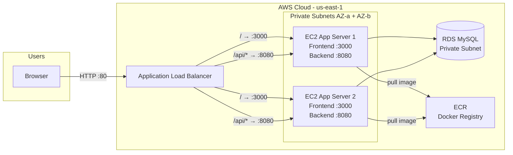

<div align="center">

# ShopFlow E-Commerce Platform

**Production-style full stack e-commerce platform deployed on AWS with Terraform and GitHub Actions CI/CD.**


[Architecture](#architecture) · [Infrastructure](#infrastructure) · [CI/CD Pipeline](#cicd-pipeline) · [Local Setup](#local-setup) · [Environment Variables](#environment-variables) · [Backend Docs](./backend/README.md)

</div>

---

> A **Next.js 16** storefront talks to an **Express** API backed by **MySQL** (Sequelize), fully containerized with Docker and deployed on AWS via **Terraform**. The entire infrastructure is provisioned as code — VPC, EC2 Auto Scaling, RDS, ECR, IAM, and ALB — with a **GitHub Actions** pipeline that builds, pushes, and deploys on every push to `main`.

---

## Table of Contents

| | |
|--|--|
| **Overview** | [Highlights](#highlights) · [Architecture](#architecture) · [Repository Map](#repository-map) |
| **Infrastructure** | [AWS Infrastructure](#infrastructure) · [Terraform Modules](#terraform-modules) · [Remote State](#remote-state) |
| **CI/CD** | [Pipeline Stages](#cicd-pipeline) · [GitHub Secrets](#github-secrets) · [Deployment Flow](#deployment-flow) |
| **Local Dev** | [Prerequisites](#prerequisites) · [Local Setup](#local-setup) · [Environment Variables](#environment-variables) |
| **Reference** | [API Overview](#api-overview) · [Database](#database) · [Troubleshooting](#troubleshooting) |

---

## Highlights

| Area | What you get |
|------|-------------|
| **Frontend** | Next.js 16, React 19, TypeScript, Tailwind, Bootstrap, MUI — served on port **3000** |
| **Backend** | Express 4, Sequelize 6, JWT auth, Google OAuth, 2FA (TOTP), Multer, Nodemailer — served on port **8080** |
| **Infrastructure** | VPC with 2 public + 2 private subnets across 2 AZs, ALB, Auto Scaling Group (1–3 instances), RDS MySQL, ECR |
| **CI/CD** | GitHub Actions: lint → docker build → ECR push → terraform plan → manual approval → terraform apply |
| **Security** | Private subnets, Bastion Host, IAM roles with least privilege, encrypted RDS, Security Groups per layer |

---

## Architecture



| Port | Service | Routed from ALB |
|-----:|---------|----------------|
| **3000** | Next.js Frontend | All traffic `/` |
| **8080** | Express Backend | Path pattern `/api/*` |
| **3306** | RDS MySQL | Internal only |

---

## Repository Map

```
shopflow/
├── README.md
├── Dockerfile                        ← Frontend image (Next.js)
├── backend/
│   ├── Dockerfile                    ← Backend image (Express)
│   ├── README.md
│   ├── app.js
│   └── ...                           ← controllers, models, routes, services
├── frontend/
│   ├── README.md
│   └── app/                          ← pages, layouts, components
├── terraform/
│   ├── backend.tf                    ← S3 remote state (native locking)
│   ├── providers.tf                  ← AWS provider ~> 5.0
│   ├── variables.tf
│   ├── main.tf                       ← Root module
│   ├── outputs.tf
│   ├── terraform.tfvars              ← Local values (gitignored)
│   ├── modules/
│   │   ├── vpc/                      ← VPC, subnets, IGW, NAT
│   │   ├── ec2/                      ← Bastion, Launch Template, ASG, ALB, SGs
│   │   ├── rds/                      ← MySQL RDS, subnet group, SG
│   │   ├── iam/                      ← Roles, policies, groups
│   │   └── ecr/                      ← ECR repository + lifecycle policy
│   └── environments/
│       └── dev/
│           └── terraform.tfvars
└── .github/
    └── workflows/
        └── pipeline.yml              ← GitHub Actions CI/CD
```

---

## Infrastructure

### AWS Resources

| Resource | Details |
|----------|---------|
| **VPC** | `10.0.0.0/16` |
| **Public Subnets** | `10.0.1.0/24` (AZ-a), `10.0.2.0/24` (AZ-b) — ALB, Bastion, NAT Gateway |
| **Private Subnets** | `10.0.3.0/24` (AZ-a), `10.0.4.0/24` (AZ-b) — EC2 App Servers, RDS |
| **Internet Gateway** | Attached to VPC |
| **NAT Gateway** | In public subnet — allows private instances to reach internet |
| **Bastion Host** | `t3.micro` in public subnet — SSH jump server |
| **Application Load Balancer** | Internet-facing, routes `/api/*` to backend, `/` to frontend |
| **Auto Scaling Group** | min 1, desired 2, max 3 — `t3.small` instances with 30GB gp3 |
| **RDS MySQL** | `db.t3.micro`, Single-AZ, encrypted, port 3306 open only from EC2 SG |
| **ECR** | Private registry, scan on push, keeps last 5 images |
| **S3** | Remote state bucket with native locking (Terraform 1.10+) |

### Terraform Modules

```
modules/
├── vpc/        VPC, 2 public subnets, 2 private subnets, IGW, NAT, route tables
├── ec2/        Bastion, Launch Template (30GB), ASG, ALB, 2 Target Groups, SGs
├── rds/        MySQL 8.0, DB Subnet Group, Security Group (port 3306 from EC2 only)
├── iam/        EC2 Role (ECR pull + CloudWatch), IAM Groups (Dev/Ops/Viewer/Admin)
└── ecr/        ECR repository + lifecycle policy
```

### Remote State

Uses **S3 native locking** (Terraform 1.10+) — no DynamoDB needed:

```hcl
terraform {
  backend "s3" {
    bucket       = "shopflow-terraform-state"
    key          = "dev/terraform.tfstate"
    region       = "us-east-1"
    use_lockfile = true
    encrypt      = true
  }
}
```

### IAM Groups

| Group | Permissions |
|-------|------------|
| Developers | ECR Push, EC2 Read, S3 Read |
| Operators | Full EC2, RDS Read |
| Viewers | Read Only |
| Admins | Full Access |
| EC2 Role | ECR Pull + CloudWatch Logs |

---

## CI/CD Pipeline

### Pipeline Stages

```
Git Push to main
      ↓
① Docker Build (frontend + backend)
      ↓
② Push Images to ECR
      ↓
③ Terraform Validate + Plan
      ↓
④ Manual Approval (GitHub Environment: production)
      ↓
⑤ Terraform Apply
      ↓
⑥ EC2 Launches via ASG → User Data pulls image from ECR → Container runs
```

### GitHub Secrets

Go to: `Repository → Settings → Secrets and variables → Actions`

| Secret | Purpose |
|--------|---------|
| `AWS_ACCESS_KEY_ID` | AWS authentication |
| `AWS_SECRET_ACCESS_KEY` | AWS authentication |
| `AWS_ACCOUNT_ID` | Used in Terraform variables |
| `DB_PASSWORD` | RDS master password (min 8 chars) |

### Manual Approval Setup

To enable the approval gate before `terraform apply`:

1. Go to `Settings → Environments → New environment`
2. Name it `production`
3. Enable **Required reviewers** and add yourself

### Deployment Flow

```
Developer
    │  git push origin main
    ▼
GitHub Actions
    │  docker build frontend → push to ECR as frontend-latest
    │  docker build backend  → push to ECR as backend-latest
    │  terraform validate + plan
    │  ⏸ wait for manual approval
    │  terraform apply
    ▼
AWS Auto Scaling Group
    │  launches EC2 from Launch Template
    ▼
EC2 User Data
    │  installs Docker + AWS CLI
    │  authenticates with ECR via IAM role
    │  pulls frontend image → runs on :3000
    │  pulls backend image  → runs on :8080
    ▼
ALB routes traffic to healthy instances
```

---

## Local Setup

### Prerequisites

- Node.js 18+ (LTS)
- npm 8+
- MySQL 8 or Docker
- Git
- AWS CLI (for manual Terraform runs)
- Terraform 1.10+

### First-time Setup

```bash
git clone https://github.com/shamsmo0/shopflow-terraform.git
cd shopflow-terraform

npm run first-run
```

This creates `.env` files from examples and installs dependencies in both `backend/` and `frontend/`.

Then edit `backend/.env` with real `DB_*` values and strong secrets.

```bash
npm run dev
```

| Command | Purpose |
|---------|---------|
| `npm run bootstrap` | Create `.env` files only |
| `npm run install:all` | Install dependencies in both apps |
| `npm run first-run` | `bootstrap` + `install:all` |
| `npm run dev` | Run frontend + backend together |
| `npm run dev:backend` | Backend only |
| `npm run dev:frontend` | Frontend only |
| `npm run build` | Production build |

### Docker (Local MySQL)

```bash
docker compose up -d
```

Set in `backend/.env`:

| Variable | Value |
|----------|-------|
| `DB_HOST` | `127.0.0.1` |
| `DB_NAME` | `shopflow` |
| `DB_USER` | `shopflow` |
| `DB_PASSWORD` | `shopflow_local` |

---

## Environment Variables

### Backend (`backend/.env`)

| Variable | Purpose |
|----------|---------|
| `PORT` | API port (default `8080`) |
| `NODE_ENV` | `development` or `production` |
| `DB_NAME`, `DB_USER`, `DB_PASSWORD`, `DB_HOST` | MySQL connection |
| `JWT_SECRET` | User JWT signing |
| `ADMIN_JWT_SECRET` | Admin JWT signing |
| `FRONTEND_URL` | CORS origin + email links |
| `BASE_URL` | Public API URL |
| `EMAIL_USER`, `EMAIL_PASSWORD` | Nodemailer SMTP |
| `GOOGLE_CLIENT_ID` | Google OAuth server-side |

### Frontend (`frontend/.env.local`)

| Variable | Purpose |
|----------|---------|
| `NEXT_PUBLIC_API_URL` | Browser → API base URL |
| `NEXT_PUBLIC_GOOGLE_CLIENT_ID` | Google OAuth client-side |

---

## API Overview

| Prefix | Area |
|--------|------|
| `/auth` | Register, login, Google OAuth, password flows |
| `/api` | Authenticated user profile |
| `/admin` | Admin panel API |
| `/product` | Catalog / CRUD |
| `/orders` | Orders |
| `/payment-methods` | Payment methods |
| `/newsletter` | Subscriptions |
| `/careers` | Careers + applications |
| `/track-order` | Order tracking |
| `/reviews` | Reviews |
| `/affiliate` | Affiliate program |
| `/static` | Static file assets |

---

## Database

- Models: `backend/model/`
- Engine: MySQL 8, utf8mb4
- ORM: Sequelize 6
- Production: use explicit migrations, avoid `ALLMODELSYNC`

---

## SSH Access (via Bastion)

```bash
# Add key to agent
eval $(ssh-agent)
ssh-add shopflow-key.pem

# Connect to Bastion with agent forwarding
ssh -A -i shopflow-key.pem ec2-user@<BASTION_PUBLIC_IP>

# From Bastion, connect to private EC2
ssh ec2-user@<PRIVATE_EC2_IP>

# Check container status
docker ps -a
docker logs shopflow-app
```

---

## Troubleshooting

| Symptom | Check |
|---------|-------|
| `502 Bad Gateway` from ALB | Container not running — check `docker ps` and `cloud-init-output.log` on EC2 |
| `no space left on device` | Root volume too small — Launch Template must have 30GB EBS |
| ECR pull fails | EC2 IAM role missing `ecr:GetAuthorizationToken` or `ecr:BatchGetImage` |
| Terraform asks for password interactively | Add `db_password` and `account_id` to `terraform.tfvars` |
| `InvalidKeyPair.Duplicate` | Key pair already exists in AWS — use `data "aws_key_pair"` instead of resource |
| RDS password error | Password must be at least 8 characters |
| Cannot SSH to private EC2 | Use `ssh -A` (agent forwarding) from Bastion, not copying the `.pem` file |
| `connection reset by peer` on `terraform init` | Network issue downloading provider — retry or use `version = "~> 5.80"` |

---

## Contributing

1. Fork and branch (`feature/short-description`)
2. Keep PRs focused
3. Never commit `.env`, `terraform.tfvars`, or AWS credentials
4. Describe what and why in the PR body

---

<div align="center">

**ShopFlow** — Infrastructure as Code · Containerized · CI/CD Automated

</div>
