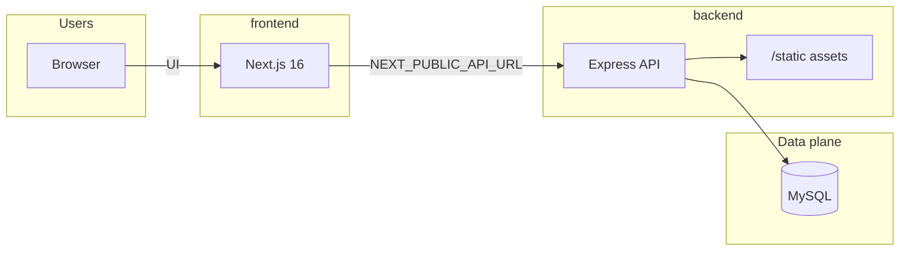

<div align="center">

# StrikeTech E‑Commerce

**Production-style full stack for commerce, accounts, and operations.**


[First-time setup](#first-time-setup-recommended) · [Quick start](#quick-start) · [Architecture](#architecture) · [Environment](#environment-variables) · [**Backend docs**](./backend/README.md) · [Contributing](#contributing)

</div>

---

> A **Next.js 16** storefront and admin experience talks to an **Express** API and **MySQL** (Sequelize). Authentication, catalog (including a public **`/categories`** index), checkout, orders, email flows, newsletters, careers, and affiliates live behind clear boundaries: **`frontend/`** for the UI, **`backend/`** for the API.

---

## Table of contents

| | |
|--|--|
| **Basics** | [Highlights](#highlights) · [Repository map](#repository-map) · [Tech stack](#technology-stack) |
| **Run** | [Prerequisites](#prerequisites) · [First-time setup](#first-time-setup-recommended) · [Install](#install) · [Quick start](#quick-start) · [Production build](#production-build-frontend) · [Scripts](#npm-scripts) |
| **Configure** | [Environment variables](#environment-variables) · [Troubleshooting](#troubleshooting) |
| **Reference** | [API overview](#api-overview) · [Database](#database) · [Security](#security) |
| **Community** | [Contributing](#contributing) · [Acknowledgments](#acknowledgments) |

---

## Highlights

| Area | What you get |
|------|----------------|
| **Experience** | App Router, TypeScript, Turbopack (dev), Tailwind, Bootstrap, SASS, MUI; admin tools (e.g. products) mix Tailwind-first UI with legacy SCSS where noted. |
| **API** | REST-style Express app, JWT flows, Google verification, 2FA (TOTP), uploads (Multer), HTML email templates, PDF/QR helpers. |
| **Data** | Sequelize models, MySQL, sync helper for local dev (see [Database](#database) for production notes). |
| **DX** | Optional **repo-root** `package.json`: one-command **`npm run first-run`**, **`npm run dev`**, and **`docker compose`** for local MySQL; each app still has its own `package.json` and **`.env`**. |

---

## Architecture



| Port (default) | Service | Folder |
|----------------:|---------|--------|
| **3000** | Next.js | `frontend/` |
| **8080** | Express | `backend/` |

<details>
<summary><strong>ASCII version</strong> (plain text / older viewers)</summary>

```text
 Browser ──► Next.js (frontend/) :3000
                │
                │  HTTP API
                ▼
           Express (backend/) :8080 ──► MySQL
```

</details>

---

## Repository map

```
ecomerce/
├── README.md                 ← You are here (platform overview)
├── package.json              ← Root scripts: first-run, dev, install:all, build
├── docker-compose.yml        ← Optional local MySQL 8 for development
├── scripts/
│   └── bootstrap.cjs         ← Creates .env files from *.example (safe, no overwrite)
├── backend/
│   ├── README.md             ← API deep dive, routes, env
│   ├── package.json
│   ├── app.js                ← HTTP server entry
│   └── …                     ← controllers, models, routes, services
└── frontend/
    ├── README.md             ← Next.js quick notes
    ├── package.json
    └── app/                  ← pages, layouts, components
```

| I want to… | Open |
|------------|------|
| Understand the **whole product** | This file |
| Run or extend the **API only** | [**backend/README.md**](./backend/README.md) |
| Run or extend the **UI only** | [frontend/README.md](./frontend/README.md) |

---

## Technology stack

| Layer | Choices |
|-------|---------|
| **Web** | Next.js 16, React 19, TypeScript, Turbopack (dev) |
| **API** | Express 4, Sequelize 6, mysql2, express-validator |
| **Auth & utilities** | JWT, bcrypt, Google Auth Library, Speakeasy (2FA), Multer, Nodemailer, PDFKit, QRCode |
| **Tooling** | npm, ESLint (frontend), Jest (optional / per package) |

---

## Prerequisites

- **Node.js** 18 or newer (LTS recommended)
- **npm** 8+
- **MySQL** 8 (or compatible), **or** [Docker](https://docs.docker.com/get-docker/) if you use the bundled `docker-compose.yml`
- **Git**

Optional: Google Cloud OAuth client if you enable Google sign-in.

---

## First-time setup (recommended)

From the **repository root** after `git clone` and `cd ecomerce`:

```bash
npm run first-run
```

This runs **`scripts/bootstrap.cjs`** (creates `backend/.env` and `frontend/.env.local` from the examples **only if they are missing**) and then **`npm run install:all`** to install both apps.

Then **edit `backend/.env`**: set real `DB_*` values and strong `JWT_SECRET` / `ADMIN_JWT_SECRET`. If you use the optional Docker database (below), use the matching `DB_*` block from [Docker MySQL (optional)](#docker-mysql-optional).

Start everything:

```bash
npm run dev
```

That runs the same **`dev:all`** script as in `frontend/package.json` (Next on **:3000** + API on **:8080**).

| Command (repo root) | Purpose |
|---------------------|---------|
| `npm run bootstrap` | Env files only (no `npm install`) |
| `npm run install:all` | `npm install` in `backend/` and `frontend/` |
| `npm run first-run` | `bootstrap` + `install:all` |
| `npm run dev` | Next + Express together |
| `npm run dev:backend` | API only |
| `npm run dev:frontend` | UI only |
| `npm run build` | Production Next build + typecheck |

You need **Node.js on your PATH** so `npm` can run `scripts/bootstrap.cjs`.

---

## Docker MySQL (optional)

If you do not already have MySQL installed, you can start a **development-only** database:

```bash
docker compose up -d
```

Wait until the container is healthy, then set these in **`backend/.env`** (and keep `DB_HOST` as `127.0.0.1` if the API runs on your host, not inside Docker):

| Variable | Value (matches `docker-compose.yml`) |
|----------|--------------------------------------|
| `DB_HOST` | `127.0.0.1` |
| `DB_NAME` | `ecomerce` |
| `DB_USER` | `ecomerce` |
| `DB_PASSWORD` | `ecomerce_local` |

The compose file also sets `MYSQL_ROOT_PASSWORD` for the root user (`root_local_change_me` by default); use your own values for anything beyond local dev.

---

## Install

Dependencies live in **`backend/node_modules`** and **`frontend/node_modules`** (two installs).

**Option A — from repo root (same as `first-run` without bootstrap):**

```bash
npm run install:all
```

**Option B — per folder:**

```bash
cd backend && npm install
cd ../frontend && npm install
```

Packages resolve from the **public npm registry** by default. If your org uses a private registry, add the appropriate `.npmrc` and run installs again in **both** folders.

---

## Quick start

Use **[First-time setup](#first-time-setup-recommended)** for the shortest path. Below is the same flow in explicit steps.

### 1. Database

**Option A — Docker (see above):** `docker compose up -d` and align `backend/.env`.

**Option B — existing MySQL:**

```sql
CREATE DATABASE your_database_name CHARACTER SET utf8mb4 COLLATE utf8mb4_unicode_ci;
CREATE USER 'your_user'@'localhost' IDENTIFIED BY 'your_password';
GRANT ALL PRIVILEGES ON your_database_name.* TO 'your_user'@'localhost';
FLUSH PRIVILEGES;
```

### 2. Environment (two files)

| File | Role |
|------|------|
| **`backend/.env`** | Server: DB, JWTs, `PORT`, `BASE_URL`, `FRONTEND_URL`, email, Google server client id |
| **`frontend/.env.local`** (or `.env`) | Browser: `NEXT_PUBLIC_API_URL`, `NEXT_PUBLIC_GOOGLE_CLIENT_ID` |

```bash
npm run bootstrap
# or manually:
cp backend/.env.example backend/.env
cp frontend/.env.example frontend/.env.local
# Edit both with real values
```

**Windows (PowerShell), from repo root:**

```powershell
node scripts/bootstrap.cjs
# or:
Copy-Item backend\.env.example backend\.env
Copy-Item frontend\.env.example frontend\.env.local
```

Never commit real secrets. Keep passwords and JWT material **only** in `backend/.env`.

### 3. Run

**Single command from repo root:**

```bash
npm run dev
```

**Or two terminals:**

```bash
# Terminal 1 — API
cd backend && npm run dev

# Terminal 2 — UI
cd frontend && npm run dev
```

**Or one terminal from `frontend/` only:**

```bash
cd frontend && npm run dev:all
```

Default URLs: app **http://localhost:3000**, API **http://localhost:8080** (override with `PORT` / env).

### Production build (frontend)

Before deploying or opening a release PR, validate the Next app:

```bash
cd frontend && npm run build
```

This runs the full compiler and TypeScript check. Fix any reported errors before shipping static export or Node hosting.

---

## Environment variables

The API loads **`backend/.env`** via `__dirname`, so it behaves the same whether you start from `backend/` or from `frontend/` scripts.

Next.js only reads env files under **`frontend/`**. Anything sent to the browser must use the **`NEXT_PUBLIC_`** prefix.

### Backend (`backend/.env`)

| Variable | Purpose |
|----------|---------|
| `PORT` | API port (default `8080`) |
| `NODE_ENV` | `development` \| `production` |
| `DB_NAME`, `DB_USER`, `DB_PASSWORD`, `DB_HOST` | MySQL |
| `JWT_SECRET` | User JWT signing |
| `ADMIN_JWT_SECRET` | Admin JWT |
| `FRONTEND_URL` | CORS + links in email |
| `BASE_URL` | Public API URL (templates, assets) |
| `EMAIL_USER`, `EMAIL_PASSWORD` | Nodemailer (prefer app passwords) |
| `GOOGLE_CLIENT_ID` | Verify Google tokens on the server |
| `FACEBOOK_URL`, `TWITTER_URL`, `INSTAGRAM_URL`, `LOGO_URL` | Optional template branding |
| `SMTP_*` | Optional SMTP for affiliate mail paths |

### Frontend (`frontend/.env.local`)

| Variable | Purpose |
|----------|---------|
| `NEXT_PUBLIC_API_URL` | Browser → API base URL |
| `NEXT_PUBLIC_GOOGLE_CLIENT_ID` | Client-side Google |

Full examples live in **`backend/.env.example`** and **`frontend/.env.example`**.

---

## npm scripts

### Repository root (`./`)

These scripts live in the **root** `package.json`. You do **not** need `npm install` at the repo root (there are no root dependencies); they use `npm --prefix` to run commands inside `backend/` and `frontend/`.

| Script | What it does |
|--------|----------------|
| `npm run bootstrap` | Create `backend/.env` and `frontend/.env.local` from examples if missing |
| `npm run install:all` | Install dependencies in both apps |
| `npm run first-run` | `bootstrap` then `install:all` |
| `npm run dev` | Next + API (same as `frontend` → `dev:all`) |
| `npm run dev:backend` / `npm run dev:frontend` | One side only |
| `npm run build` / `npm run start` / `npm run lint` | Delegate to `frontend/` |

### `backend/`

| Script | What it does |
|--------|----------------|
| `npm run dev` | Nodemon + `app.js` |
| `npm start` | Node + `app.js` |
| `npm test` | Jest (configure as needed) |

### `frontend/`

| Script | What it does |
|--------|----------------|
| `npm run dev` | Next.js dev (Turbopack) |
| `npm run server` | Delegates to `npm run dev` in `../backend` |
| `npm run dev:all` | Next + backend concurrently |
| `npm run build` | Production build (includes TypeScript); required before many deploy paths |
| `npm start` | Next production + backend `npm start` |
| `npm run lint` | ESLint |

---

## API overview

Mounted prefixes (see `backend/routes/index.js` and [**backend/README**](./backend/README.md) for detail):

| Prefix | Area |
|--------|------|
| `/` | Root (EJS home) |
| `/auth` | Register, login, Google, password flows |
| `/api` | Authenticated profile and related |
| `/admin` | Admin panel API |
| `/product` | Catalog / CRUD |
| `/payment-methods` | Payment methods |
| `/orders` | Orders |
| `/newsletter` | Subscriptions |
| `/careers` | Careers + applications |
| `/track-order` | Tracking |
| `/reviews` | Reviews |
| `/affiliate` | Affiliate program |

Static files are exposed at **`/static`** from `backend/static/`.

---

## Database

- Models: `backend/model/`
- Startup sync: `ALLMODELSYNC` (convenient for local development; for production, plan explicit migrations and controlled schema changes).

---

## Security

- Use **unique, long** `JWT_SECRET` and `ADMIN_JWT_SECRET` per environment.
- Run production with **HTTPS** and `NODE_ENV=production` so cookies and errors follow secure defaults.
- Lock **CORS** to your real frontend origin (`FRONTEND_URL`).
- Report sensitive vulnerabilities **privately** to maintainers when public disclosure would harm users.

---

## Troubleshooting

| Symptom | Check |
|---------|--------|
| API “cannot find module” | Run `npm install` inside **`backend/`**. |
| Blank API / wrong DB | **`backend/.env`** present and `DB_*` correct. |
| CORS errors | **`FRONTEND_URL`** matches the browser origin exactly. |
| UI cannot reach API | **`NEXT_PUBLIC_API_URL`** matches `PORT` / `BASE_URL`. |
| `/static` 404 | File exists under **`backend/static/`**; restart API after changes. |
| Email failures | **`EMAIL_*`** or SMTP vars; Gmail needs an **app password**. |
| Next.js build: `useSearchParams` / prerender error | Client pages that call **`useSearchParams()`** must render that subtree inside a **`<Suspense>`** boundary (see Next.js docs: *Missing Suspense with CSR bailout*). |
| Type check: `apiClient` / `response.data` | The shared **`apiClient`** returns a typed JSON envelope. Pass an explicit generic (e.g. `apiClient<MyType[]>(...)`) when you need a typed **`data`** payload, or unwrap in a small helper (see `app/utils/orderApi.ts`). |
| `docker compose` / MySQL port **3306** in use | Stop the other MySQL or change the host port mapping in **`docker-compose.yml`**. |

---

## Contributing

**Contributions are welcome.** Issues, docs, and pull requests all help.

1. Fork and branch (`feature/short-description`).
2. Keep PRs focused and match local code style.
3. Do not commit `.env` or secrets.
4. Describe **what** and **why** in the PR body.

Be constructive in review threads. Maintainers may defer or decline changes that are out of scope or hard to maintain without prior discussion.

---

## Acknowledgments

Built on [Next.js](https://nextjs.org/), [Express](https://expressjs.com/), [Sequelize](https://sequelize.org/), and [MySQL](https://www.mysql.com/)—and on feedback from everyone who opens issues and PRs.

---

<div align="center">

**StrikeTech**

*Lasting first impressions come from clear docs, reliable defaults, and respectful collaboration.*

</div>
